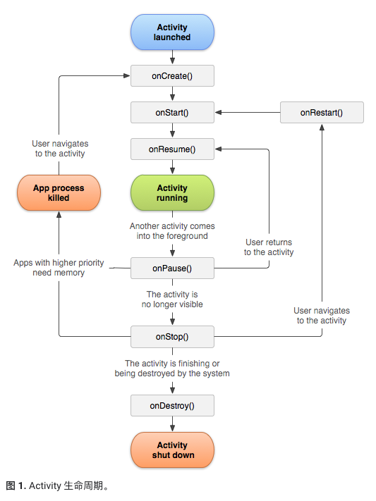

# Activity

[安卓官网](https://developer.android.google.cn/guide/components/activities/intro-activities)

activity是Android组件中最基本也是最为常见用的四大组件之一。Android四大组件有Activity，Service服务，Content Provider内容提供，BroadcastReceiver广播接收器。

在一个android应用中，一个Activity通常就是一个单独的屏幕，它上面可以显示一些控件也可以监听并处理用户的事件做出响应。Activity之间通过Intent进行通信。


### 创建

清单文件里，并将 <activity> 元素添加为 <application>元素的子项
```
<application ... > 
    <activity android:name=".ExampleActivity" /> ...
</application ... >
```

使用 Intent 过滤器

<activity> 元素还可指定各种 Intent 过滤器—使用 <intent-filter> 元素—以声明其他应用组件激活它的方法。

当您使用 Android SDK 工具创建新应用时，系统自动为您创建的存根 Activity 包含一个 Intent 过滤器，其中声明了该 Activity 响应“主”操作且应置于“launcher”类别内。 Intent 过滤器的内容如下所示：
```
<activity android:name=".ExampleActivity" android:icon="@drawable/app_icon">
    <intent-filter>
        <action android:name="android.intent.action.MAIN" />
        <category android:name="android.intent.category.LAUNCHER" />
    </intent-filter>
</activity>
```


### 启动

Activity 表示应用中的一个屏幕。通过将 Intent 传递给 startActivity()，您可以启动新的 Activity 实例。Intent 用于描述要启动的 Activity，并携带任何必要的数据。

如果您希望在 Activity 完成后收到结果，请调用 startActivityForResult()。在 Activity 的 onActivityResult() 回调中，您的 Activity 将结果作为单独的 Intent 对象接收。如需了解详细信息，请参阅 Activity 指南。

- 显式 Intent：通过提供目标应用的软件包名称或完全限定的组件类名来指定可处理 Intent 的应用。通常，您会在自己的应用中使用显式 Intent 来启动组件，这是因为您知道要启动的 Activity 或服务的类名。例如，您可能会启动您应用内的新 Activity 以响应用户操作，或者启动服务以在后台下载文件。
- 隐式 Intent ：不会指定特定的组件，而是声明要执行的常规操作，从而允许其他应用中的组件来处理。例如，如需在地图上向用户显示位置，则可以使用隐式 Intent，请求另一具有此功能的应用在地图上显示指定的位置。

### 生命周期



### 启动模式

- standard
- singleTop
- singleTask
- singleInstance

1. <activity>标签中设置android:launchMode="****"属性即可

2. 使用Intent的addFlags()方法来添加一些标志，


