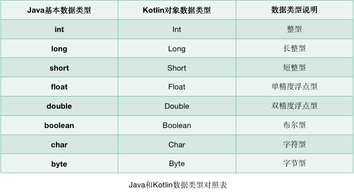
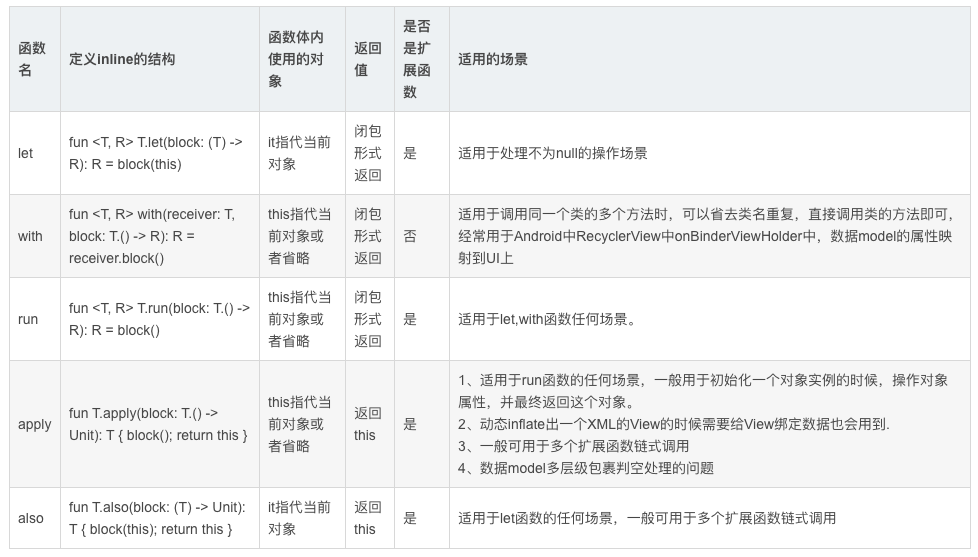

- [语法](#语法)
    - [优势](#优势)
    - [在线运行Kotlin代码](#在线运行kotlin代码)
    - [变量](#变量)
    - [函数](#函数)
    - [逻辑控制](#逻辑控制)
      - [if](#if)
      - [when](#when)
      - [for-in循环语句](#for-in循环语句)
    - [面向对象](#面向对象)
      - [类与对象](#类与对象)
        - [继承](#继承)
        - [接口](#接口)
      - [数据类 data](#数据类-data)
      - [单例类 object](#单例类-object)
    - [Lambda编程](#lambda编程)
      - [定义](#定义)
      - [集合的创建](#集合的创建)
    - [Java函数式API](#java函数式api)
    - [空指针检查](#空指针检查)
    - [字符串内嵌表达式](#字符串内嵌表达式)
    - [函数的参数默认值](#函数的参数默认值)
    - [内联函数](#内联函数)
      - [let](#let)
      - [with](#with)
      - [run](#run)
      - [apply](#apply)
      - [also](#also)
      - [区别](#区别)
  
  
# 语法

### 优势
Kotlin相比于Java的优势

- 语法更加简洁，对于同样的功能，使用Kotlin开发的代码量可能会比使用Java开发的减少50%甚至更多。
- 语法更加高级，相比于Java比较老旧的语法，Kotlin增加了很多现代高级语言的语法特性，使得开发效率大大提升。
- 语言更加安全，Kotlin几乎杜绝了空指针这个全球崩溃率最高的异常。
- 和Java是100%兼容的，Kotlin可以直接调用使用Java编写的代码，也可以无缝使用Java第三方的开源库。这使得Kotlin在加入了诸多新特性的同时，还继承了Java的全部财富。


### 在线运行Kotlin代码
JetBrains专门提供了一个可以在线运行Kotlin代码的网站，地址是：
[https://try.kotlinlang.org/](https://try.kotlinlang.org/)

### 变量
- val（value的简写的简写）用来声明一个不可变的变量，这种变量在初始赋值之后就再也不能重新赋值，对应Java中的final变量。
- var（variable的简写的简写）用来声明一个可变的变量，这种变量在初始赋值之后仍然可以再被重新赋值复制，对应Java中的非final变量。

```kotlin
fun main() {
    val a = 10
    var b = 5
    b = b + 3
    println("a = " + a)
    println("b = " + b)
}
```
Kotlin完全抛弃了Java中的基本数据类型，全部使用了对象数据类型。在Java中int是整型变量的关键字，而在Kotlin中Int变成了一个类，它拥有自己的方法和继承结构。



### 函数
```
fun methodName(param1: Int, param2: Int): Int {
      return 0
}
```
当一个函数的函数体中只有一行代码时，可以使用单行代码函数的语法糖：
```
fun methodName(param1: Int, param2: Int) = 0
```
使用这种写法，可以直接将唯一的一行代码写在函数定义的尾部，中间用等号连接即可。

return关键字也可以省略，等号足以表达返回值的意思。

Kotlin还拥有出色的类型推导机制，可以自动推导出返回值的类型。

### 逻辑控制
#### if
Kotlin中的if语句相比于Java有一个额外的功能：它是可以有返回值的，返回值就是if语句每一个条件中最后一行代码的返回值。
```
fun largerNumber(num1: Int, num2: Int): Int {
    return if (num1 > num2) {
        num1
    } else {
        num2
    }
}
```
精简后
```
fun largerNumber(num1: Int, num2: Int) = if (num1 > num2) num1 else num2
```

#### when
```
fun getScore(name: String) = when (name) {
    "Tom" -> 86
    "Jim" -> 77
    "Jack" -> 95
    "Lily" -> 100
    else -> 0
}
```
when语句还允许进行类型匹配
```
fun checkNumber(num: Number) {
    when (num) {
        is Int -> println("number is Int")
        is Double -> println("number is Double")
        else -> println("number not support")
    }
}
```
#### for-in循环语句
我们可以使用如下Kotlin代码来表示一个区间：
```
//[0, 10]
val range = 0..10
//[0, 10)
val range = 0 until 10

fun main() {
    for (i in 0..10) {
        println(i)
    }
}

//想跳过其中的一些元素，可以使用step关键字：
fun main() {
    for (i in 0 until 10 step 2) {
        println(i)
    }
}

//降序的区间，可以使用downTo关键字：
fun main() {
    for (i in 10 downTo 1) {
        println(i)
    }
}

```

### 面向对象
#### 类与对象
```
class Person {
    var name = ""
    var age = 0

    fun eat() {
        println(name + " is eating. He is " + age + " years old.")
    }
}


fun main() {
    val p = Person()
    p.name = "Jack"
    p.age = 19
    p.eat()
}

```
##### 继承
Kotlin中的所有类都有一个公共的父类Any
Any不是java.lang.Object，Any只包含equals(),hashCode()以及toString()三个成员


类默认是不可以被继承的，如果想要让一个类可以被继承，需要主动声明open关键字：
```
open class Person {
    …
}
//另一个类去继承Person类，则需要使用冒号关键字：
class Student : Person() {
    var sno = ""
    var grade = 0
}

```
##### 接口
Kotlin中定义接口的关键字和Java中是相同的，都是使用的interface：
```
interface Study {
    fun readBooks()
    fun doHomework()
}

//实现接口的关键字变量了冒号，和继承使用的是同样的关键字：
class Student(val name: String, val age: Int) : Study {
    override fun readBooks() {
        println(name + " is reading.")
    }

    override fun doHomework() {
        println(name + " is doing homework.")
    }
}

//如果一个类从它的直接父类继承了同一个成员的多个实现，那么它必须复写这个成员并且提供自己的实现，要使用父类中提供的方法，用super<Base>来表示
open class A {
    open fun f() { print("A") }
    fun a() { print("a") } // 不会被重写
}

interface B {
    fun f() { print("B") } // 接口成员默认是open的
    fun b() { print("b") }
}

class C() : A(), B {
    // The compiler requires f() to be overridden:
    override fun f() {
        super<A>.f() // call to A.f()
        super<B>.f() // call to B.f()
    }
}

```

#### 数据类 data
使用data关键字可以定义一个数据类：

数据类的主构造函数中的参数将equals()、hashCode()、toString()等固定且无实际逻辑意义的方法自动生成，从而大大简少了开发的工作量。
```
data class Cellphone(val brand: String, val price: Double)
```

#### 单例类 object
object关键字可以定义一个单例类：
```
object Singleton {
    fun singletonTest() {
        println("singletonTest is called.")
    }
}

//调用单例类中的函数比较类似于Java中静态方法的调用方式：
Singleton.singletonTest()

//这种写法虽然看上去像是静态方法的调用，但其实Kotlin在背后自动帮我们创建了一个Singleton类的实例，并且保证全局只会存在一个Singleton实例。
```

### Lambda编程
#### 定义
Lambda就是一小段可以作为参数传递的代码。正常情况下，我们向某个函数传参时只能传入变量，而借助Lambda却允许传入一小段代码。

语法结构：
{参数名1: 参数类型, 参数名2: 参数类型 -> 函数体}

```
fun main() {
    val list = listOf("Apple", "Banana", "Orange", "Pear", "Grape", "Watermelon")
    val newList = list.map({ fruit: String -> fruit.toUpperCase() })
    for (fruit in newList) {
        println(fruit)
    }
}

```
- 当Lambda参数是函数的最后一个参数时，可以将Lambda表达式移到函数括号的外面。

- 如果Lambda参数是函数的唯一一个参数的话，还可以将函数的括号省略。

- 由于Kotlin拥有出色的类型推导机制，Lambda表达式中的参数列表其实在大多数情况下也不必声明参数类型。

- 当Lambda表达式的参数列表中只有一个参数时，也不必声明参数名，而是可以使用it关键字来代替。

```
val newList = list.map { it.toUpperCase() }
```


#### 集合的创建
```
val list = listOf("Apple", "Banana", "Orange", "Pear", "Grape")

val set = setOf("Apple", "Banana", "Orange", "Pear", "Grape")

val map = mapOf("Apple" to 1, "Banana" to 2, "Orange" to 3, "Pear" to 4, "Grape" to 5)
```

### Java函数式API
如果我们在Kotlin代码中调用了一个Java方法，并且该方法接收一个Java单抽象方法接口参数，就可以使用函数式API。Java单抽象方法接口指的是接口中只有一个待实现方法，如果接口中有多个待实现方法，则无法使用函数式API。

```
// 举个例子，Android中有一个极为常用的点击事件接口OnClickListener，其定义如下：

public interface OnClickListener {
     void onClick(View v);
}

// 可以看到，这是一个单抽象方法接口。假设现在我们拥有一个按钮button的实例，就可以使用函数式API的写法来注册这个按钮的点击事件：

button.setOnClickListener { v ->
}
```

### 空指针检查

```
// Kotlin默认所有的参数和变量都不可为空，所以这里传入的Study参数也一定不会为空，可以放心地调用它的任何函数。
fun doStudy(study: Study) {
    study.readBooks()
    study.doHomework()
}

//Kotlin提供了另外一套可为空的类型系统，就是在类名的后面加上一个问号。比如，Int表示不可为空的整型，而Int?就表示可为空的整型；String表示不可为空的字符串，而String?就表示可为空的字符串。

// 使用可为空的类型系统时，需要在编译时期就把所有的空指针异常都处理掉才行。

```

Kotlin提供了一系列的辅助工具，使开发者能够更轻松地进行判空处理
```
if (a != null) {
    a.doSomething()
}
// 可以写成
a?.doSomething()

```

```
// ?: 操作符表示如果左边表达式的结果不为空就返回左边表达式的结果，否则就返回右边表达式的结果

val c = if (a ! = null) {
    a
} else {
    b
}
// 可以写成
val c = a ?: b
```

```
// 结合使用?.操作符和let函数也可以对多次重复调用的某个变量统一进行判空处理：

fun doStudy(study: Study?) {
    study?.let {
        it.readBooks()
        it.doHomework()
    }
}

```

### 字符串内嵌表达式
```
"hello, ${obj.name}. nice to meet you!"
//当表达式中仅有一个变量的时候，还可以将两边的大括号省略：
"hello, $name. nice to meet you!"
```

### 函数的参数默认值
```
// 当调用printParams()函数时，可以选择给第二个参数传值，也可以选择不传，在不传的情况下就会自动使用默认值。
fun printParams(num: Int, str: String = "hello") {
    println("num is $num , str is $str")
}
```
### 内联函数
#### let
返回值为函数块的最后一行或指定return表达式。

let函数适用的场景:
- 场景一: 最常用的场景就是使用let函数处理需要针对一个可null的对象统一做判空处理。

- 场景二: 然后就是需要去明确一个变量所处特定的作用域范围内可以使用

```
mVideoPlayer?.setVideoView(activity.course_video_view)
mVideoPlayer?.setControllerView(activity.course_video_controller_view)
mVideoPlayer?.setCurtainView(activity.course_video_curtain_view)

// 优化后
mVideoPlayer?.let {
	   it.setVideoView(activity.course_video_view)
	   it.setControllerView(activity.course_video_controller_view)
	   it.setCurtainView(activity.course_video_curtain_view)
}
```

#### with

适用于调用同一个类的多个方法时，可以省去类名重复，直接调用类的方法即可，经常用于Android中RecyclerView中onBinderViewHolder中，数据model的属性映射到UI上

```
// java 实现
@Override
public void onBindViewHolder(ViewHolder holder, int position) {

   ArticleSnippet item = getItem(position);
		if (item == null) {
			return;
		}
		holder.tvNewsTitle.setText(StringUtils.trimToEmpty(item.titleEn));
		holder.tvNewsSummary.setText(StringUtils.trimToEmpty(item.summary));
		String gradeInfo = "难度：" + item.gradeInfo;
		String wordCount = "单词数：" + item.length;
		String reviewNum = "读后感：" + item.numReviews;
		String extraInfo = gradeInfo + " | " + wordCount + " | " + reviewNum;
		holder.tvExtraInfo.setText(extraInfo);
		...
}

//kotlin使用with
override fun onBindViewHolder(holder: ViewHolder, position: Int){
   val item = getItem(position)?: return
   with(item){
      holder.tvNewsTitle.text = StringUtils.trimToEmpty(titleEn)
	   holder.tvNewsSummary.text = StringUtils.trimToEmpty(summary)
	   holder.tvExtraInf.text = "难度：$gradeInfo | 单词数：$length | 读后感: $numReviews"
       ...  
   }

}
```

#### run
适用于let,with函数任何场景。因为run函数是let,with两个函数结合体，准确来说它弥补了let函数在函数体内必须使用it参数替代对象，在run函数中可以像with函数一样可以省略，直接访问实例的公有属性和方法，另一方面它弥补了with函数传入对象判空问题，在run函数中可以像let函数一样做判空处理
```
//上述例子中
override fun onBindViewHolder(holder: ViewHolder, position: Int){
   
  getItem(position)?.run{
      holder.tvNewsTitle.text = StringUtils.trimToEmpty(titleEn)
	   holder.tvNewsSummary.text = StringUtils.trimToEmpty(summary)
	   holder.tvExtraInf = "难度：$gradeInfo | 单词数：$length | 读后感: $numReviews"
       ...   
   }
}
```

#### apply

整体作用功能和run函数很像，唯一不同点就是它返回的值是对象本身，而run函数是一个闭包形式返回，返回的是最后一行的值。正是基于这一点差异它的适用场景稍微与run函数有点不一样。apply一般用于一个对象实例初始化的时候，需要对对象中的属性进行赋值。或者动态inflate出一个XML的View的时候需要给View绑定数据也会用到，这种情景非常常见。特别是在我们开发中会有一些数据model向View model转化实例化的过程中需要用到。

```
mSheetDialogView = View.inflate(activity, R.layout.biz_exam_plan_layout_sheet_inner, null)
        mSheetDialogView.course_comment_tv_label.paint.isFakeBoldText = true
        mSheetDialogView.course_comment_tv_score.paint.isFakeBoldText = true
        mSheetDialogView.course_comment_tv_cancel.paint.isFakeBoldText = true
        mSheetDialogView.course_comment_tv_confirm.paint.isFakeBoldText = true
        mSheetDialogView.course_comment_seek_bar.max = 10
        mSheetDialogView.course_comment_seek_bar.progress = 0

// 使用apply
   mSheetDialogView = View.inflate(activity, R.layout.biz_exam_plan_layout_sheet_inner, null).apply{
   course_comment_tv_label.paint.isFakeBoldText = true
   course_comment_tv_score.paint.isFakeBoldText = true
   course_comment_tv_cancel.paint.isFakeBoldText = true
   course_comment_tv_confirm.paint.isFakeBoldText = true
   course_comment_seek_bar.max = 10
   course_comment_seek_bar.progress = 0
}
```

多层级判空问题

```
if (mSectionMetaData == null || mSectionMetaData.questionnaire == null || mSectionMetaData.section == null) {
			return;
		}
if (mSectionMetaData.questionnaire.userProject != null) {
			renderAnalysis();
			return;
		}
if (mSectionMetaData.section != null && !mSectionMetaData.section.sectionArticles.isEmpty()) {
			fetchQuestionData();
			return;
		}

//使用 apply
mSectionMetaData?.apply{
    //mSectionMetaData不为空的时候操作mSectionMetaData
}?.questionnaire?.apply{
    //questionnaire不为空的时候操作questionnaire
}?.section?.apply{
    //section不为空的时候操作section
}?.sectionArticle?.apply{
    //sectionArticle不为空的时候操作sectionArticle
}

```

#### also
适用于let函数的任何场景，also函数和let很像，只是唯一的不同点就是let函数最后的返回值是最后一行的返回值而also函数的返回值是返回当前的这个对象。一般可用于多个扩展函数链式调用

#### 区别

