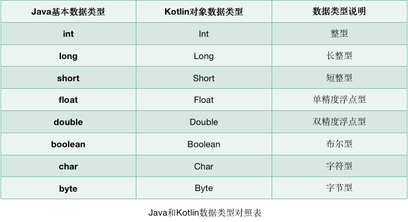

 * [语法](#\xE8\xAF\xAD\xE6\xB3\x95)
     * [在线运行Kotlin代码](#\xE5\x9C\xA8\xE7\xBA\xBF\xE8\xBF\x90\xE8\xA1\x8Ckotlin\xE4\xBB\xA3\xE7\xA0\x81)
     * [变量](#\xE5\x8F\x98\xE9\x87\x8F)
     * [函数](#\xE5\x87\xBD\xE6\x95\xB0)
     * [逻辑控制](#\xE9\x80\xBB\xE8\xBE\x91\xE6\x8E\xA7\xE5\x88\xB6)
        * [if](#if)
        * [when](#when)
        * [for-in循环语句](#for-in\xE5\xBE\xAA\xE7\x8E\xAF\xE8\xAF\xAD\xE5\x8F\xA5)
     * [面向对象](#\xE9\x9D\xA2\xE5\x90\x91\xE5\xAF\xB9\xE8\xB1\xA1)
        * [类与对象](#\xE7\xB1\xBB\xE4\xB8\x8E\xE5\xAF\xB9\xE8\xB1\xA1)
           * [继承](#\xE7\xBB\xA7\xE6\x89\xBF)
           * [接口](#\xE6\x8E\xA5\xE5\x8F\xA3)
        * [数据类 data](#\xE6\x95\xB0\xE6\x8D\xAE\xE7\xB1\xBB-data)
        * [单例类 object](#\xE5\x8D\x95\xE4\xBE\x8B\xE7\xB1\xBB-object)
     * [Lambda编程](#lambda\xE7\xBC\x96\xE7\xA8\x8B)
        * [定义](#\xE5\xAE\x9A\xE4\xB9\x89)
        * [集合的创建](#\xE9\x9B\x86\xE5\x90\x88\xE7\x9A\x84\xE5\x88\x9B\xE5\xBB\xBA)


# 语法

### 在线运行Kotlin代码
JetBrains专门提供了一个可以在线运行Kotlin代码的网站，地址是：
[https://try.kotlinlang.org/](https://try.kotlinlang.org/)

### 变量
- val（value的简写的简写）用来声明一个不可变的变量，这种变量在初始赋值之后就再也不能重新赋值，对应Java中的final变量。
- var（variable的简写的简写）用来声明一个可变的变量，这种变量在初始赋值之后仍然可以再被重新赋值复制，对应Java中的非final变量。

```kotlin
fun main() {
    val a = 10
    var b = 5
    b = b + 3
    println("a = " + a)
    println("b = " + b)
}
```
Kotlin完全抛弃了Java中的基本数据类型，全部使用了对象数据类型。在Java中int是整型变量的关键字，而在Kotlin中Int变成了一个类，它拥有自己的方法和继承结构。



### 函数
```
fun methodName(param1: Int, param2: Int): Int {
      return 0
}
```
当一个函数的函数体中只有一行代码时，可以使用单行代码函数的语法糖：
```
fun methodName(param1: Int, param2: Int) = 0
```
使用这种写法，可以直接将唯一的一行代码写在函数定义的尾部，中间用等号连接即可。

return关键字也可以省略，等号足以表达返回值的意思。

Kotlin还拥有出色的类型推导机制，可以自动推导出返回值的类型。

### 逻辑控制
#### if
Kotlin中的if语句相比于Java有一个额外的功能：它是可以有返回值的，返回值就是if语句每一个条件中最后一行代码的返回值。
```
fun largerNumber(num1: Int, num2: Int): Int {
    return if (num1 > num2) {
        num1
    } else {
        num2
    }
}
```
精简后
```
fun largerNumber(num1: Int, num2: Int) = if (num1 > num2) num1 else num2
```

#### when
```
fun getScore(name: String) = when (name) {
    "Tom" -> 86
    "Jim" -> 77
    "Jack" -> 95
    "Lily" -> 100
    else -> 0
}
```
when语句还允许进行类型匹配
```
fun checkNumber(num: Number) {
    when (num) {
        is Int -> println("number is Int")
        is Double -> println("number is Double")
        else -> println("number not support")
    }
}
```
#### for-in循环语句
我们可以使用如下Kotlin代码来表示一个区间：
```
//[0, 10]
val range = 0..10
//[0, 10)
val range = 0 until 10

fun main() {
    for (i in 0..10) {
        println(i)
    }
}

//想跳过其中的一些元素，可以使用step关键字：
fun main() {
    for (i in 0 until 10 step 2) {
        println(i)
    }
}

//降序的区间，可以使用downTo关键字：
fun main() {
    for (i in 10 downTo 1) {
        println(i)
    }
}

```

### 面向对象
#### 类与对象
```
class Person {
    var name = ""
    var age = 0

    fun eat() {
        println(name + " is eating. He is " + age + " years old.")
    }
}


fun main() {
    val p = Person()
    p.name = "Jack"
    p.age = 19
    p.eat()
}

```
##### 继承
Kotlin中的所有类都有一个公共的父类Any
Any不是java.lang.Object，Any只包含equals(),hashCode()以及toString()三个成员


类默认是不可以被继承的，如果想要让一个类可以被继承，需要主动声明open关键字：
```
open class Person {
    …
}
//另一个类去继承Person类，则需要使用冒号关键字：
class Student : Person() {
    var sno = ""
    var grade = 0
}

```
##### 接口
Kotlin中定义接口的关键字和Java中是相同的，都是使用的interface：
```
interface Study {
    fun readBooks()
    fun doHomework()
}

//实现接口的关键字变量了冒号，和继承使用的是同样的关键字：
class Student(val name: String, val age: Int) : Study {
    override fun readBooks() {
        println(name + " is reading.")
    }

    override fun doHomework() {
        println(name + " is doing homework.")
    }
}

//如果一个类从它的直接父类继承了同一个成员的多个实现，那么它必须复写这个成员并且提供自己的实现，要使用父类中提供的方法，用super<Base>来表示
open class A {
    open fun f() { print("A") }
    fun a() { print("a") } // 不会被重写
}

interface B {
    fun f() { print("B") } // 接口成员默认是open的
    fun b() { print("b") }
}

class C() : A(), B {
    // The compiler requires f() to be overridden:
    override fun f() {
        super<A>.f() // call to A.f()
        super<B>.f() // call to B.f()
    }
}

```

#### 数据类 data
使用data关键字可以定义一个数据类：

数据类的主构造函数中的参数将equals()、hashCode()、toString()等固定且无实际逻辑意义的方法自动生成，从而大大简少了开发的工作量。
```
data class Cellphone(val brand: String, val price: Double)
```

#### 单例类 object
object关键字可以定义一个单例类：
```
object Singleton {
    fun singletonTest() {
        println("singletonTest is called.")
    }
}

//调用单例类中的函数比较类似于Java中静态方法的调用方式：
Singleton.singletonTest()

//这种写法虽然看上去像是静态方法的调用，但其实Kotlin在背后自动帮我们创建了一个Singleton类的实例，并且保证全局只会存在一个Singleton实例。
```

### Lambda编程
#### 定义
Lambda就是一小段可以作为参数传递的代码。正常情况下，我们向某个函数传参时只能传入变量，而借助Lambda却允许传入一小段代码。


#### 集合的创建
```
val list = listOf("Apple", "Banana", "Orange", "Pear", "Grape")

val set = setOf("Apple", "Banana", "Orange", "Pear", "Grape")

val map = mapOf("Apple" to 1, "Banana" to 2, "Orange" to 3, "Pear" to 4, "Grape" to 5)
```


