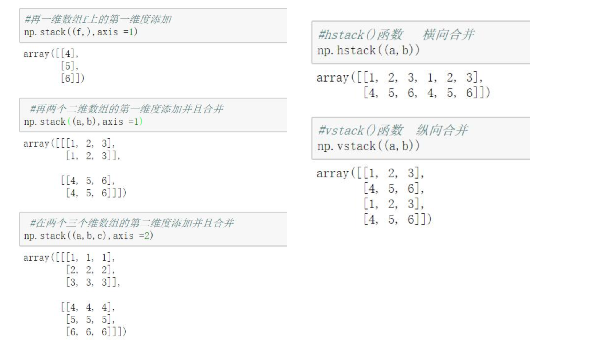

# numpy


### Scipy库简介
Scipy库是基于Python生态的一款开源数值计算、科学与工程应用的 开源软件，主要包括NumPy、Scipy、pandas、matplotlib等等

[官方文档:https://scipy.org/](https://scipy.org/)

### numPy、Scipy、pandas、matplotlib简介

#### numpy——基础
以矩阵为基础的数学计算模块，纯数学存储和处理大型矩阵。 这个是很基 础的扩展，其余的扩展都是以此为基础。

#### scipy——数值计算库
在numPy库的基础上增加了众多的数学、科学以及工程计算中常用的库 函数。 方便、易于使用、专为科学和工程设计的Python工具包.它包括统计,优化,整合,线性代 数模块,傅里叶变换,信号和图像处理,常微分方程求解器等等。

#### pandas——数据分析
基于numPy 的一种工具，为了解决数据分析任务而创建的.Pandas 纳 入了大量库和一些标准的数据模型，提供了高效地操作大型数据集所需的工具。

#### matplotlib——绘图
对于图像美化方面比较完可以自善，定义线条的颜色和式样，可以在一 张绘图纸上绘制多张小图，也可在一张图上绘制多条线，可以很方便的对数据进行可视化分析。

### numpy

[官网:http://www.numpy.org/](http://www.numpy.org/)

[官方文档:https://docs.scipy.org/doc/numpy/user/index.html](https://docs.scipy.org/doc/numpy/user/index.html)

#### numpy 主要包括
- 一个具有矢量算术运算和复杂广播能力的快速且节省空间的多维数组，称为 ndarray(N-dimensional array object)
- 用于对整组数据进行快速运算的标准数学函数:ufunc(universal function object)
- 实用的线性代数、傅里叶变换和随机数生成函数。
- NumPy和稀疏矩阵的运算包Scipy配合使用更加方便。

#### ndarray

- NumPy的数组类被称作ndarray。通常被称作数组。注意numpy.array和标准Python库类array.array并不相同，后者只处理一维数组和提供少量功能。
- 一种由相同类型的元素组成的多维数组，元素数量是事先给定好的 
- 元素的数据类型由dtype(data-type)对象来指定，每个ndarray只有一种dtype类型
- ndarray的大小固定，创建好数组后数组大小是不会再发生改变的

#### ndarray创建
<a href="./01_ndarray的创建.ipynb"
title="numpy">具体可以查看01_ndarray代码</a>

主要创建方法：
- array函数:接收一个普通的python序列，并将其转换为ndarray 
- zeros函数:创建指定长度或者形状的全零数组。 
- ones函数:创建指定长度或者形状的全1数组。
- empty函数:创建一个没有任何具体值的数组(准确地说是创建一些未初始化
  的ndarray多维数组)

其它创建：
- arange函数: 类似python的range函数，通过指定开始值、终值和步长来
  创建一个一维数组，注意:最终创建的数组不包含终值
- linspace函数:通过指定开始值、终值和元素个数来创建一个一维数组， 数组的数据元素符合等差数列，可以通过endpoint关键字指定是否包含终 值，默认包含终值
- logspace函数:和linspace函数类似，不过创建的是等比数列数组
- 使用随机数填充数组，即使用numpy.random中的random()函数来创建 0-1之间的随机元素，数组包含的元素数量由参数决定


### ndarray对象属性

- ndim 数组轴(维度)的个数，轴的个数被称作秩
- shape 数组的维度,
  例如一个2排3列的矩阵，它的shape属性将是(2,3),这个元组的长度显然是秩，即维度或者ndim属性
- size 数组元素的总个数，等于shape属性中元组元素的乘积。
- dtype 一个用来描述数组中元素类型的对象，可以通过创造或 指定dtype使用标准Python类型。不过NumPy提供它自己的数 据类型。
- itemsize 数组中每个元素的字节大小。例如，一个元素类型为 float64的数组itemsiz属性值为8(=64/8),又如，一个元素类型为 complex32的数组item属性为4(=32/8).


#### ndarray修改形状

1. 直接修改数组ndarray的shape值, 要求修改后乘积不变。
2. 直接使用reshape函数创建一个改变尺寸的新数组，原数组的shape保持不变，但
   是新数组和原数组共享一个内存空间，也就是修改任何一个数组中的值都会对另外
   一个产生影响，另外要求新数组的元素个数和原数组一致(还可以降维操作)
3. 当指定某一个轴为-1的时候，表示将根据数组元素的数量自动计算该轴的 长度值。 


### NumPy基本操作
- 数组与标量、数组之间的运算 
- 数组的矩阵积(matrix product)
- 数组的索引与切片
- 数组的转置与轴对换 
- 数组的拉伸与合并 
- 通用函数:快速的元素级数组成函数 
- 聚合函数
- np.where函数 
- np.unique函数

### ndarray-数组与标量、数组之间的运算
- 数组不用循环即可对每个元素执行批量的算术运算操作，这个过程叫做矢量化，即用数组表达式代替循环的做法。
- 矢量化数组运算性能比纯Python方式快上一两个数据级。
- 大小相等的两个数组之间的任何算术运算都会将其运算应用到元素级上的操作。
- 元素级操作:在NumPy中，大小相等的数组之间的运算，为元素级运算， 即只用于位置相同的元素之间，所得的运算结果组成一个新的数组，运算 结果的位置跟操作数位置相同。

### ndarray-数组的矩阵积
- 矩阵积(matrix product):
  两个二维矩阵(行和列的矩阵)满足第一个矩阵的列数与第二个矩阵的行数相同，那么可以进行矩阵的乘法，即矩阵积，矩阵积不是元素级的运算。也称为点积、数量积。
  

  
  意义：


  
  
### ndarray-多维数组的索引


### ndarray-数组的切片

切片获得的数组只是原来数据的一个索引，改变的时候，会改变原有的数据


### ndarray-花式索引

花式索引(Fancy indexing)指的是利用整数数组进行索引的方式。


### ndarray-布尔类型索引


### ndarray-数组转置与轴对换

- 数组转置是指将shape进行重置操作，并将其值重置为原始shape元 组的倒置，比如原始的shape值为:(2,3,4)，那么转置后的新元组的 shape的值为: (4,3,2)
- 对于二维数组而言(矩阵)数组的转置其实就是矩阵的转置 
- 可以通过调用数组的transpose函数或者T属性进行数组转置操作


---


```
 这种多维转置：transpose(1,2,0)后： 元素arr[0,1,2]新的位置为arr1[1,2,0]
```

### ndarray-数组拉伸与合并
- 数组拉伸np.tile(A，rep)函数可以将数组A进行拉伸，沿着A的维 度重复rep次
- 对于ndarray数组而言，多个数组可以执行合并操作，合并的方式有 多种。
- Stack(arrays,axis=0):沿着新的轴加入一系列数组 
- vstack():堆栈数组垂直顺序(行) 
- hstack():堆栈数组水平顺序(列)。


---



### 聚合函数

聚合函数是对一组值(eg一个数组)进行操作，返回一个单一值作为结果的函数。 当然聚合函数也可以指定对某个具体的轴进行数据聚合操作;常见的聚合操作有: 平均值、最大值、最小值、总体标准偏差等等


---


### np.where函数

np.where函数是三元表达式x if condition else y的矢量化版本


### np.unique函数

np.unique函数的主要作用是将数组中的元素进行去重操作(也就是 只保存不重复的数据)


  


