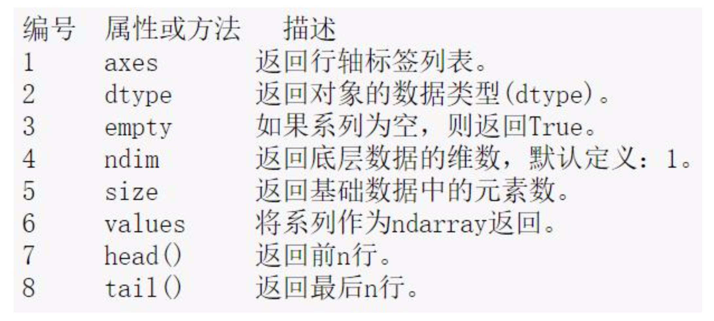

# pandas

pandas是一种Python数据分析的利器，是一个开源的数据分析包， 最初是应用于金融数据分析工具而开发出来的，因此pandas为时间 序列分析提供了很好的支持。pandas是PyData项目的一部分。

[官网:http://pandas.pydata.org/](http://pandas.pydata.org/)

[官方文档:http://pandas.pydata.org/pandas-docs/stable/](http://pandas.pydata.org/pandas-docs/stable/)

#### pandas引入约定

- from pandas import Series, DataFrame
- import pandas as pd

pandas中主要有两种数据结构，分别是:Series和DataFrame。

- Series:一种类似于一维数组的对象，是由一组数据(各种NumPy数 据类型)以及一组与之相关的数据标签(即索引)组成。仅由一组数据也 可产生简单的Series对象。注意:Series中的索引值是可以重复的

- DataFrame:一个表格型的数据结构，包含有一组有序的列，每列 可以是不同的值类型(数值、字符串、布尔型等)，DataFrame即有行 索引也有列索引，可以被看做是由Series组成的字典。

#### Series:创建

<a href="./pandas.ipynb" title="pandas">具体可以查看pandas代码</a>

- 通过一维数组创建
- 通过字典的方式创建

### Series:

#### 常见Series的属性

代码：<a href="./pandas.ipynb" title="pandas">具体可以查看pandas代码</a>

- Series对象本身以及索引都具有一个name属性，默认为空，根据需 要可以进行赋值操作

#### Series值的获取

Series值的获取主要有两种方式:

- 通过方括号+索引的方式读取对应索引的数据，有可能返回多条数据
- 通过方括号+下标值的方式读取对应下标值的数据，下标值的取值范围为:
  [0，len(Series.values));另外下标值也可以是负数，表示从右往左获取数据
- Series获取多个值的方式类似NumPy中的ndarray的切片操作，通 过方括号+下标值/索引值+冒号(:)的形式来截取series对象中的一部 分数

#### Series的运算

- 注意:其实在操作Series的时候，基本上可以把Series看成NumPy 中的ndarray数组来进行操作。ndarray数组的绝大多数操作都可以 应用到Series上。

#### Series缺失值检测
pandas中的isnull和notnull两个函数可以用于在Series中检测缺失 值，这两个函数的返回时一个布尔类型的Series

pd.isnull(series) 返回boolean

series\[pd.isnull(series)\] 返回筛选后都数据

### DataFrame

#### 

